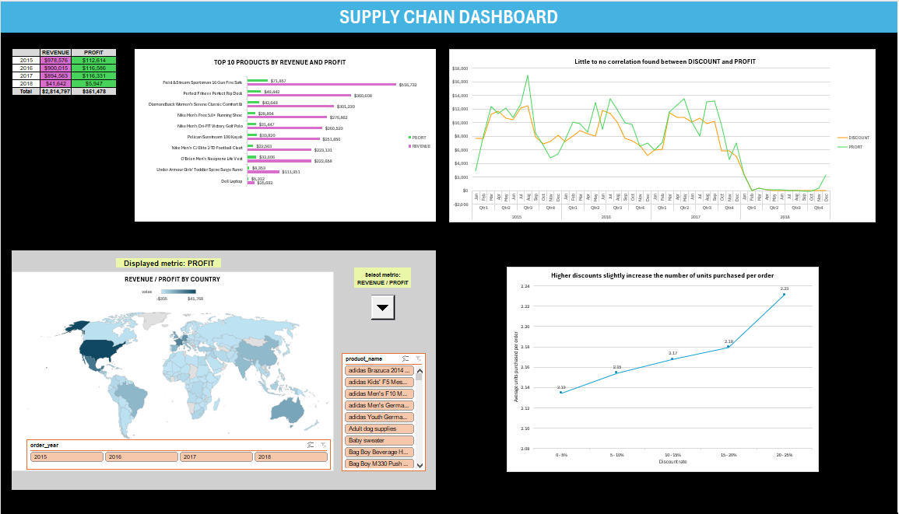

# 📦 Supply-Chain Analytics – Excel & Power Query

## 🎯 Project Overview
This project showcases my ability to transform and visualize data using **Excel**. The analysis is based on real-world logistics data that required extensive cleanup before meaningful insights could be performed.

## 📊 Dashboard Preview

## 🛠️ Tech Stack
* **Excel:** Final reporting and visualization.
* **Power Query:** Advanced data cleaning, ETL processes, and merging datasets.
* **AI Assistance:** Used for complex formula logic and idea exploration.

## ⚙️ Data Cleaning & Transformation (Power Query)
* **Source:** Kaggle (CSV files).
* **Key Transformations:**
    * **Currency Standardization:** Fixed missing currency specifications and converted regional values to USD.
    * **Data Integrity:** Handled decimal place inconsistencies and removed mathematically impossible values.
    * **Categorization:** Corrected mislabeled product categories for accurate grouping.

## 💡 Key Business Insights
* **Revenue & Profit:** Identified Top 10 products driving the majority of profitability.
* **Discount Impact:** Analyzed how higher discounts affect order volume vs. actual profit margins.
* **Geographical Trends:** Map visualization showing dominating regions by revenue.

---
**Data Source:** https://www.kaggle.com/datasets/pushpitkamboj/logistics-data-containing-real-world-data
